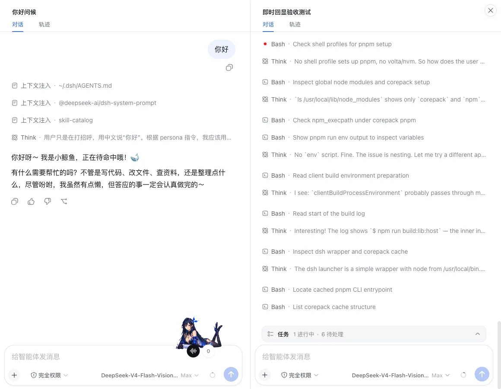

# dsh-multi-window

Current master targets Harness **0.2.1-alpha.1** and includes the native plugin upgrade made with [dsh-plugin-upgrade-skill](https://github.com/oh-my-dsh/dsh-plugin-upgrade-skill/). Download the current branch for this source update; existing releases retain their original version.

English | [中文](README.md)

  

Open multiple independent conversations side by side, each with isolated navigation, drafts, and runtime state.

## Install

1. Open [Releases](https://github.com/niushuanan/dsh-multi-window/releases/latest) and download the attached ZIP.
2. Give the ZIP to an AI that can read and modify the target DSH project.
3. Tell the AI: **Read AGENTS.md, INSTALL.md, and manifest.json first. Install only this plugin and preserve existing plugins, data, conversations, attachments, and settings.**
4. The installing AI merges the code and Cordis rows into the target version and validates only the entry points directly owned by this plugin.

## Contents

- <code>payload/</code>: plugin code and required runtime assets copied from the main repository.
- <code>manifest.json</code>: composition rows, sources, main-repository commit, and per-file SHA-256.
- <code>INSTALL.md</code>: direct installation, conflict adaptation, failure recovery, and narrow verification.
- <code>docs/</code>: real product screenshots from this version.

## Source and license

This repository is a one-way distribution mirror of [Xiaozhuang DSH](https://github.com/niushuanan/xiaozhuang-dsh), not an independent development source. It is synchronized from main-repository commit [`49b1c5207b`](https://github.com/niushuanan/xiaozhuang-dsh/commit/49b1c5207b1556515752c6bf9e7902c1a5964ad9) and released as [`xiaozhuang-v0.4.2`](https://github.com/niushuanan/dsh-multi-window/releases/tag/xiaozhuang-v0.4.2). Licensed under the [MIT License](LICENSE).
